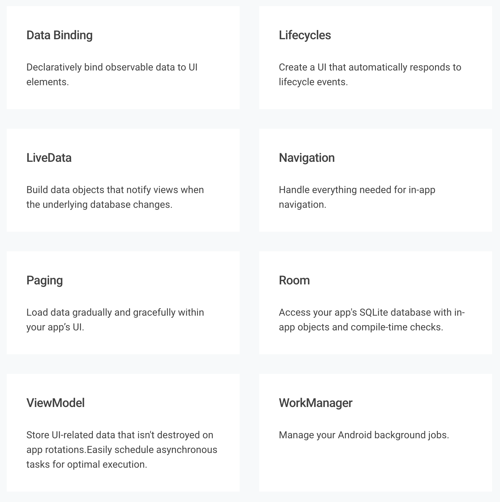

# Android架构组件（一）

## 简介

Android Architecture Components是官方发布的一系列的库，它的目的是，让我们更好的组织APP的架构，打造出足够稳定，可测试，易维护的APP。

Google在2017年5月发布了Android Architecture Components的1.0.0Alpha1版，最初的版本只有Lifecycles，LiveData，ViewModel和Room 4个组件，经历半年之后，在2017年11月6日发布了Android Architecture Components 1.0.0正式版。2018年，又持续发布了1.1.0的测试版。

2018年5月的Google I/O大会上，推出了**Jetpack**，它为开发者提供了一套解决方案，帮助开发者更高效开发APP。Jetpack中包含了4类大的组件库，Architecture Components即其中的一个，4类组件库分别解决不同的问题。

- Architecture Components --解决架构的问题
- Foundation Components --包括旧版本旧版本兼容（support库），kotlin扩展，MultiDex以及测试框架
- UI Components --UI相关的，包括动画，布局，Android Auto，Wear OS等等
- Behavior Components --包括下载，多媒体，通知，权限，分享，Slice等

2018年5月，除了最初的4个组件的新版本之外，在Architecture Components这一系列的组件库中又陆续发布了DataBinding，Paging，Navigation，WorkManager等组件，截止到2018年6月，Architecture Components中一共包含了8个组件。在2018年5月初，最新发布的架构组件中，进行了重构（改了包名和artifacts），此时同时发布了AndroidX项目，Architecture Components被移动到了AndroidX中（引用组件的时候，group和旧的不一样）。


## 架构组件功能



1. Data Binding

 Data Binding可以在布局文件中通过特定的格式绑定数据，省去了通过View对象用代码设置数据的步骤。
 
 ```xml
 <TextView
     android:text="@{viewmodel.userName}" />
 ```
 
2. Lifecycles

 创建UI自动响应其他组件（Activity，Fragment等）生命周期变化，帮助我们更好的组织代码，可以少写很多生命周期相关的代码，使得代码更易维护。
 
3. LivaData

 LiveData使用观察者模式来更新数据，它实际是一个观察者，但是和普通的观察者不一样，它和APP组件（Activity等）生命周期密切相关，使用它能确保只在特定的生命周期内更新组件数据，能避免很多不必要的异常。
 
4. ViewModel

 ViewModel用来存储一些和UI密切相关的数据，它可以保证屏幕旋转或者页面重建之后这些数据不会轻易被销毁。
 
5. Room

 Room是一个数据库框架，用来做数据持久化，使用它可以做到对象到数据库字段的映射，还能做一些编译时检查的工作。
 
6. Navigation

 顾名思义，Navigation是用来简化应用内页面导航的。
 
7. Paging
 
 Paging用来做数据渐进式加载，比如RecyclerView的分页。使用它只需要加载UI上需要的数据，可以节省网络贷款平台和系统资源，还能获得更快的响应速度。

8. WorkManager

 WorkManger用来管理应用的后台任务和异步任务。


