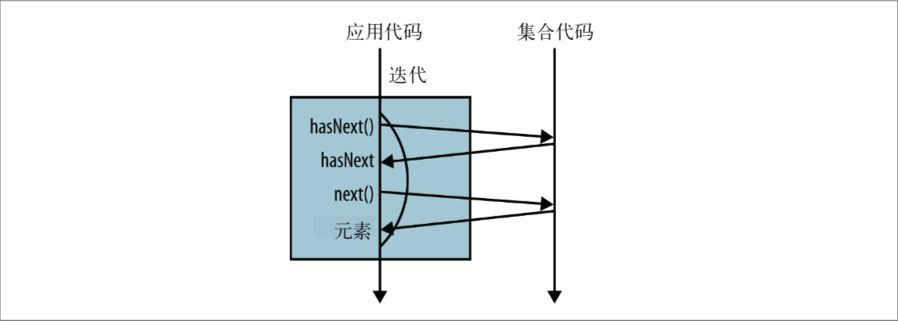
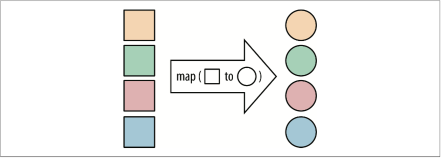
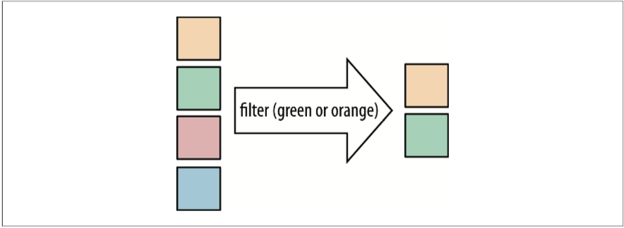
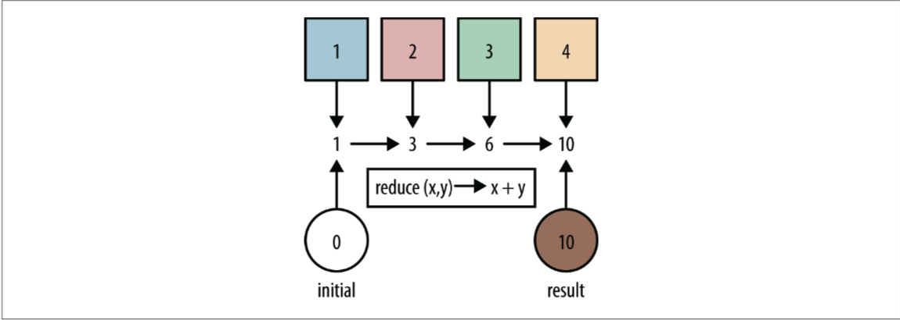

# 1 流

## 1.1 流是什么

**流**是Java 8中新引入的概念，它允许你以声明式方式处理数据集合（通过查询语句来表达，而不是临时编写一个实现）。

举个例子，筛选出价格大于¥50的菜品，并对这些菜品进行排序，最后返回菜品名称的集合，在Java 8之前：

```Java
//第一步，筛选
List<Dish> tempList = new ArrayList<>(dishes.size());
for (Dish dish : dishes) {
	if (dish.getPriceCent() > 5000) {
		tempList.add(dish);
	}
}
//第二步，排序
Collections.sort(tempList, new Comparator<Dish>() {
	public int compare(Dish d1, Dish d2) {
		return d1.getPriceCent() - d2.getPriceCent();
	}
});
//第三步，返回名称集合
List<String> result = new ArrayList<>(tempList.size())
for (Dish dish : tempList) {
	result.add(dish.getName());
}
```
在Java 8中，引入了流的概念之后，结合Lambda表达式：

```Java
List<String> result = dishes.stream()
							.filter(dish -> dish.getPriceCent() > 5000)
							.sorted(comparing(Dish::getPriceCent))
							.map(Dish::getName)
							.collect(toList());
```

流式方法的好处：

- 代码是以声明性方式写的，说明想要完成什么，而不是如何实现一个操作；
- 把几个基本操作链接起来，用以表达复杂的数据操作流水线，使代码清晰可读。

使用Java 8的Stream API可以写出这样的代码：

- 声明性——更简洁 ，更易读
- 可复合——更灵活
- 可并行——性能更好

## 1.2 流简介

### 1.2.1 概念和术语

Java 8中的集合支持一个新的stream方法，它会返回一个流，当然也有很多其他方法，比如利用数值范围或者I/O资源也可以生成流元素。

定义：**从支持数据处理操作的源生成得元素序列。**

关键概念：

|术语 			|说明	|
|----			|----		|
|元素序列		|类似集合，流提供一个接口，可以访问特定元素类型的一组有序值。集合讲的是数据，流讲的是计算。|
|源				|流会使用一个提供数据的源，比如集合、数组或者是I/O. 从有序集合生成流时会保留原有的序列。|
|数据处理操作	|流的数据处理功能类似于数据库的操作，以及函数式编程语言中的常用操作，如filter、map、reduce、find、match、sort等。流操作可以顺序执行，也可以并行执行。|
|流水线			|很多的流操作本身会返回一个流，这样多个操作就可以链接起来，形成一个流水线。|
|内部迭代		|和使用迭代器进行显示迭代的集合不同，流的迭代操作是在背后进行的。|

### 1.2.2 外部迭代与内部迭代

使用Collection接口需要用户自己去做迭代，称为**外部迭代**。

使用Stream进行的迭代是**内部迭代**，Stream已经帮你把迭代做了，你只需要告诉它你需要干什么就可以了。

外部迭代：


内部迭代：


## 1.3 常见的流操作

### 1.3.1 collect(toList)

collect(toList)方法由Stream里的值生成一个列表。of方法可以生成一个流对象。

```Java
List<String> list = Stream.of("a", "b", "c").collect(Collectors.toList());
```

### 1.3.2 map

map操作可以将一个流中的一种值转换成另一种类型的值，生成一个新的流(一对一映射)。比如，将一个集合中的字符串全部转换成大写。

```Java
List<String> upperCaseList = Stream.of("talk", "is", "cheap", ",", "show", "me", "the", "code")
                .map(string -> string.toUpperCase())
                .collect(Collectors.toList());

/*
	output:
	[TALK,IS,CHEAP,,,SHOW,ME,THE,CODE]
*/
```

 

map操作传入的Lambda表达式必须和Function接口的签名一致。

```Java
public interface Function<T, R> {
    R apply(T t);
}
```

### 1.3.3 flatMap
flatMap方法使一个流中的每个值都换成另外一个流，然后把所有的流都连接起来成为一个流（笛卡尔乘积）。

```Java
//找出两个数组中共同的元素，形成一个集合

Integer[] array1 = {1, 2, 3, 4, 5, 6, 7, 8, 9};
Integer[] array2 = {2, 3, 5, 7, 11};
List<Integer[]> list = Stream
                .of(array1)
                .flatMap(a1 -> Stream.of(array2).filter(a1::equals).map(a2 -> new Integer[]{a1, a2}))
                .collect(Collectors.toList());
  
/*
	output:
	[<2, 2>, <3, 3>, <5, 5>, <7, 7>]
*/
```

flatMap操作接收的Lambda表达式必须与Function接口的签名一致，传入的范型为Function<? super T, ? extends Stream<? extends R>>.

### 1.3.4 filter

filter用来遍历数据并选出符合特定条件的元素。比如筛选出一个字符串集合中仅含数字的字符串。

```Java
List<String> digitList = Stream.of("a1c", "123", "1q2qw", "0.5")
                .filter(string -> TextUtils.isDigitsOnly(string))
                .collect(Collectors.toList());
                
/*
	output:
	[123]
*/
```



同样，filter操作传入的Lambda表达式必须和Predicate接口的签名一致。

```Java
public interface Predicate<T> {
    boolean test(T t);
}
```

### 1.3.5 distinct

disdint方法会返回一个元素各异的流，简单来说，就是滤重（根据元素的hashCode和equals方法）。

```Java
List<Integer> distinctList = Stream.of(1, 1, 2, 2, 3, 3, 3, 4)
                .distinct()
                .collect(Collectors.toList());
	
/*
	output:
	[1,2,3,4]
*/	
```

### 1.3.6 limit
limit(n)会返回一个不超过给定长度的流。如果流是有序的，则最多会返回前n个元素。

```Java
List<Integer> list = Stream.of(1, 2, 3, 4, 5, 6, 7)
                .limit(3)
                .collect(Collectors.toList());
	
/*
	output:
	[1,2,3]
*/
```

### 1.3.7 skip
skip(n)，会返回扔掉前n个元素的流，如果流中元素不超过n，则会返回一个空的流。

```Java
List<Integer> list = Stream.of(1, 2, 3, 4, 5, 6, 7)
                .skip(3)
                .collect(Collectors.toList());
	
/*	
	output:
	[4,5,6,7]
*/
```

### 1.3.8 min和max

求最小值和求最大值。比如求菜品集合中价格最低和最高的菜。

```Java
List<Dish> dishes = ...
Dish max = dishes.stream()
	.max(Comparator.comparing(dish -> dish.getPrice))
	.get();
	
Dish min = dishes.stream()
	.mix(Comparator.comparing(dish -> dish.getPrice))
	.get();
```

### 1.3.9 reduce

reduce操作可以从一组值中生成一个值，实际上max和min也是reduce操作，因为太常用，所以被纳入了标准库中。举例，求和：

```Java
int sum = Stream.of(1, 2, 3, 4)
	.reduce(0, (acc, element) -> acc + element);
```



reduce对应的操作有3个重载的方法：

```Java
//无初始值的
Optional<T> reduce(BinaryOperator<T> accumulator);

//等价于
boolean foundAny = false;
T result = null;
for (T element : this stream) {
	if (!foundAny) {
	   foundAny = true;
    	result = element;
    } else {
    	result = accumulator.apply(result, element);
    }
}
return foundAny ? Optional.of(result) : Optional.empty();
```

```Java
//带初始值的
T reduce(T identity, BinaryOperator<T> accumulator);

//等价于
T result = identity;
for (T element : this stream)
    result = accumulator.apply(result, element)
return result;
```

```Java
//参数带两个BiFuction的
<U> U reduce(U identity,
				BiFunction<U, ? super T, U> accumulator,
             BinaryOperator<U> combiner);
             
//等价于
U result = identity;
for (T element : this stream)
    result = accumulator.apply(result, element)
return result;
```

### 1.3.10 anyMatch、allMatch和noneMatch

anyMatch判断流中是否至少有一个元素能匹配给定的条件，返回一个boolean值。

```Java
 boolean hasNullElements = Stream.of("Java", "Python", "C#", null, "Ruby", "Go", "Object C")
                .anyMatch(Objects::isNull);
```

allMatch检查流中流中所有元素是否匹配给定的条件，返回boolean值。

noneMatch检查流中所以元素是否都不匹配给定的条件，返回boolean值。

### 1.3.11 findAny与findFirst

findAny找到流中任意一个元素(通常是第一个)，返回一个Optional对象，如果流是空的，返回一个值为空的Optional对象，如果找到的元素刚好是空值，则抛出一个NullPointerException。

```Java
public final class Optional<T> {
	T t;
	//...
}
```
例：

```Java
Optional<Integer> optional = Stream.of(1, 2, 3, 4, 5, 6, 7)
                .findAny();
                
//执行多次optional.get()始终是1
```
如果使用的是并行的流，那么findAny方法返回的值则是不确定的，比如下面的例子：

```Java
List<Integer> array = Arrays.asList(1, 2, 3, 4, 5, 6, 7);
Printer.println(array.parallelStream().findAny().get());
Printer.println(array.parallelStream().findAny().get());
Printer.println(array.parallelStream().findAny().get());
Printer.println(array.parallelStream().findAny().get());

/* 执行多次返回值分别是：
第1次：
5
5
5
5

Process finished with exit code 0

第2次：
4
7
2
6

Process finished with exit code 0
*/
```
findAny操作一般和filter结合起来用，用于筛选。

如果想始终找到第一个元素，则应该用findFirst操作，即使是并行的流，页始终能返回第一个元素。

*短路求值：对于有些操作，不必处理整个流就能得到结果，就像用 || 连接起来的布尔表达式求值一样，只要提前找到一个为true的值就直接返回。流的操作中，anyMatch、findAny、findFirst都是短路操作，limit也是。*

## 1.4 流与集合

### 1.4.1 流与集合概念的差异

从前面的例子中可以看到，通过Stream.of(...)方法可以得到一个流对象，看起来数据源似乎是保存在了流对象中，这和集合中保存一组数据很类似。但是，最终从流中获取一个集合，还需要调用collect(toList())方法，由此可见，流并不是集合。

流与集合到底有什么差异呢？举一个形象的例子，存在DVD中的电影，这就是一个集合，因为它包含了电影的全部数据，而网上在线播放的视频则是一个视频流，它只加载你当前观看的这几帧，不用等到所有的数据都加载完了才能看。

所以简单来讲，集合与流之间的差异就在于何时进行计算。集合是内存中的一种数据结构，它包含了数据源的所有值，集合的每个元素都需要先计算出来然后再加入到集合中。而流的元素则是按需计算，仅仅在用户需要的时候才会提取值，这是一种生产者—消费者的关系，只有消费者要求的时候才会去计算值。

### 1.4.2 流只能遍历一次

和迭代器类似，流只能遍历一次，遍历完成之后，这个流就已经被消费掉了。如果想再次遍历，需从数据源重新获取一个流（如果数据源是可重复的比如集合，这会很容易，但如果像I/O这种的话，就会很麻烦）。

重复消费一个流会抛出IllegalArgumentException，表示流已经被操作，或者关闭。

```
List<String> firms = Arrays.asList("Google", "AT&T", "Amazon", "Facebook", "Oracle", "MicroSoft");
Stream<String> stream = Stream.of(firms);
stream.forEach(System.out::println);
stream.forEach(System.out::println);
```

## 1.5 流的构建

### 1.5.1 数值流
 
在有些流的操作中，流中的元素如果是数值，会不可避免的产生装箱和拆箱的操作，比如，对菜品的价格求和：

```
List<Dish> dishes ...
int sumPrice = dishes.stream()
		.map(Dish::getPrice)
		.reduce(0, Integer::sum);
``` 
这段代码中，map操作会生成一个Stream<T>的流，因此，就需要将int类型装箱成Integer。在Java 8的Stream API中，为了避免这种拆装箱，提供了原始类型流特化，专门支持处理数值流。

#### 1.5.1.1 原始类型流特化

Java 8中引入的原始类型流特化流有3个：IntStream、LongStream和DoubleStream，分别将流的元素特化为对应的基础类型。相应的这些流中也多了一些常用的数值操作，比如sum, average, max, min等。

将流转化成特定的数值流常用的操作是map，对应的，map操作也有几个特定的方法，mapToInt、mapToLong、mapToDouble。比如上面对菜品价格求和的操作，就可以用IntStream来做：

```Java
List<Dish> dishes ...
int sumPrice = dishes.stream()
		.mapToInt(Dish::getPrice)
		.sum;
```

有时候，也会有将数值流转回对象流的需求，这时候只需要将基础元素进行装箱操作就可以，使用的操作是boxed。

```Java
IntStream intSream = dishes.stream()
		.mapToInt(Dish::getPrice);
Stream<Integer> stream = intStream.boxed();
```

上面讲findAny和findFirst操作的时候，提到了Optional对象，类似的，Optional类也对数值的基础类型进行了特化，有IntOptitonal、LongOptional和DoubleOptional三个类。

#### 1.5.1.2 数值范围

Java 8引入了两个可以用于InStream和LongStream的静态方法，range和rangeClose。区别是range不包含结束值，rangeClosed包含结束值。

```Java
IntStream intStream = IntStream.range(1, 10);
        int[] array = intStream.toArray();
        Printer.print(array);
/*
	output:
	[1,2,3,4,5,6,7,8,9]
*/
```

```Java
IntStream intStream = IntStream.rangeClosed(1, 10);
        int[] array = intStream.toArray();
        Printer.print(array);
/*
	output:
	[1,2,3,4,5,6,7,8,9,10]
```

### 1.5.2 构建流的几种方式

#### 1.5.2.1 由值创建流

使用Stream.of(T t ...)方法可以创建出一个流，Stream.empty()可以创建一个没有元素的流：

```Java
Stream<String> stringStream = Stream.of("Apple", "MicroSoft", "Google", "Facebook", "Amazon");
Stream<String> emptyStream = Stream.empty();
```

#### 1.5.2.2 由数组创建流

Arrays.stream可以从数组创建一个流，参数是一个数组。

```Java
String[] stringArray = {"Apple", "MicroSoft", "Google", "Facebook", "Amazon"};
int[] intArray = {0, 1, 1, 2, 3, 5, 8, 13, 21};
        
Stream<String> stringStream = Arrays.stream(stringArray);
IntStream intStream = Arrays.stream(intArray);
Stream<Integer> integerStream = Arrays.stream(intArray).boxed();
```

#### 1.5.2.3 由集合生成流

Java的Collection接口中，引入了stream()和parallelStream()两个默认方法，可以生成流。

```Java
String[] stringArray = {"Apple", "MicroSoft", "Google", "Facebook", "Amazon"};
List<String> list = Arrays.asList(stringArray);
Stream<String> stream = list.stream();
Stream<String> parallelStream = list.parallelStream();
```

#### 1.5.2.4 由文件生成流

Java 8的NIO API中，很多操作都可以返回一个流。比如，Files.lines就会根据文件内容返回一个流。

```Java
try {
            Stream<String> lines = Files.lines(Paths.get(".gitignore"), Charset.forName("utf-8"))
                    .flatMap(line -> Arrays.stream(line.split(" ")));
            lines.forEach(word -> Printer.println(word));
        } catch (IOException e) {
            e.printStackTrace();
        }

```

#### 1.5.2.5 由函数生成流：创建无限流

Stream API中提供了2个静态方法来从方法中生成流：Stream.iterate和Stream.generate，这2个方法都可以用来创建无限流，只要不结束，可以一直算下去。

**iterate**

iterate方法有两个重载的方法：

```Java
//有结束条件的
public static<T> Stream<T> iterate(T seed, Predicate<? super T> hasNext, UnaryOperator<T> next)
```
和

```Java
//没有限制，可以真正生成无限流
public static<T> Stream<T> iterate(final T seed, final UnaryOperator<T> f)
```

例如，生成一个斐波那契数列：

```Java
Stream.iterate(new int[]{0, 1},  t -> new int[] {t[1], t[0] + t[1]})
                .map(t -> t[0])
                .limit(20)
                .forEach(Printer::println);
```


**generate**

和iterate方法类似，generate也生成一个无限流。

```Java
public static<T> Stream<T> generate(Supplier<? extends T> s)
```

generate方法的参数是一个Supplier，它可以是无状态的，也可以是有状态的。

无状态的Supplier，不会记录上一个状态，比如生成随机数，

```Java
Stream.generate(Math::random)
                .limit(20)
                .forEach(Printer::println);
```
有状态的Supplier还可以是有状态的，它会记录前一个Supplier的状态（可以是值，属性等），比如还是生成一个斐波那契数列，在构建每一个元素时，都改变了supplier的属性：

```Java
IntSupplier supplier = new IntSupplier() {
            private int pre = 0;
            private int cur = 1;

            @Override
            public int getAsInt() {
                int oldPre = pre;
                int oldCur = cur;
                this.pre = cur;
                this.cur = oldPre + oldCur;
                return oldPre;
            }
        };
        IntStream.generate(supplier)
                .limit(20)
                .forEach(Printer::println);
```

----
Author: Ivan J. Lee
Date  : 2017-12-27 23:56


